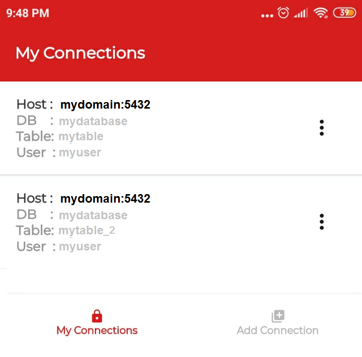

Intro
===========================

Overview
------------

AcuGIS Scout is a simple mobile form builder for PostgreSQL.

It creates a form based upon a single table, as well as capturing lat/lon and altitude.

System Requirements
-------------------
AcuGIS Scout is available for Android and iOS.

Authors
-------
* `David Ghedini`_

.. _`David Ghedini`: https://github.com/DavidGhedini

    

